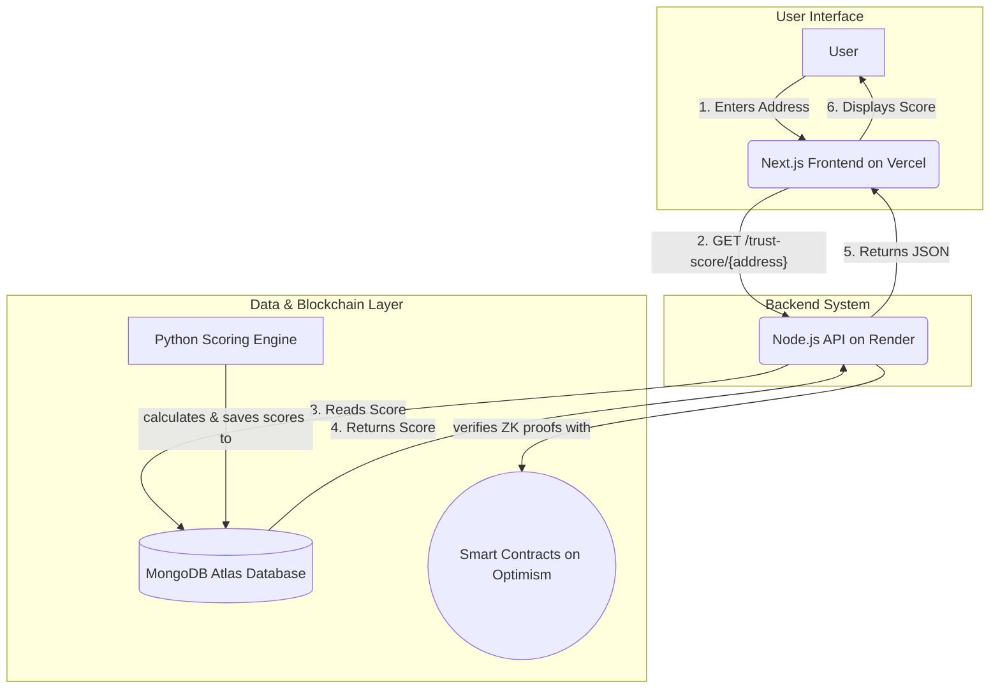
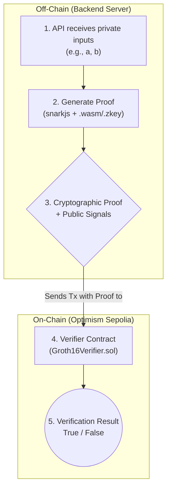

# TrustNet - A Decentralized Social Trust Graph Agent

**Live Application:** **[https://trustnetprotocol.vercel.app/](https://trustnetprotocol.vercel.app/)**
 
**Live Backend API:** **[https://backend-nvi1.onrender.com/](https://backend-nvi1.onrender.com/)**

---

## ✅ Hackathon Requirements Checklist

This project was built for **Track 5: Social Trust Graph Agent** and successfully implements all core requirements and demonstrates advanced concepts from the overall hackathon theme.

- [x] **Graph Construction:** Built from real IPFS data and simulated Lens/Ceramic data.
- [x] **Reputation Propagation:** Implemented via the industry-standard **PageRank** algorithm to measure network influence.
- [x] **ZK-Verified Endorsements:** Deployed a **real, end-to-end Groth16 ZK-proof system** on the Optimism testnet for private attestations.
- [x] **Dynamic Trust Scoring:** Implemented a **hybrid AI model combining PageRank with NLP sentiment analysis**.
- [x] **Privacy-Preserving Architecture:** Demonstrated with the functional ZK pipeline and a simulated TEE workflow.
- [x] **Decentralized Identity & Storage:** Integrated with IPFS and designed for Ceramic DID protocols.
- [x] **Modular & Deployable:** Fully deployed as a modular full-stack application on Vercel and Render.

---

## 1. Problem Statement

In the high-stakes world of Web3 fundraising, social proof and reputation are paramount, but verifying them is difficult. Capital allocation often relies on centralized platforms or opaque personal networks, creating high barriers to entry for new talent and increasing risks like sybil attacks for investors. How can we quantify a contributor's credibility in a decentralized, private, and mathematically verifiable way?

## 2. Our Solution: TrustNet

TrustNet is a decentralized reputation engine that constructs a dynamic social trust graph. It analyzes on-chain and off-chain data—including project collaborations and peer endorsements—to generate a robust, dynamic trust score for any Web3 contributor. This allows platforms like OnlyFounders to identify high-quality partners and allocate capital with confidence, based on **verifiable proof instead of persuasion.**

## 3. Exploring the Trust Graph: Example Personas

Our dataset is populated with several on-chain personas to demonstrate the nuances of the scoring model. You can test the [live application](https://trustnetprotocol.vercel.app/) using addresses representing these archetypes:

* #### The Highly-Connected Influencer
    * **Description:** This persona represents a well-regarded entity that receives many high-quality endorsements, making them a central hub in the graph.
    * **Example Address:** `0xGURU`
    * **Expected Result:** A top-tier score (near 100), as their high PageRank is further boosted by positive NLP sentiment from endorsements.

* #### The Core Contributor
    * **Description:** This persona is an active developer with multiple project collaborations and strong, reciprocal endorsements from their peers.
    * **Example Address:** `0xA1` or `0xB2`
    * **Expected Result:** A strong, positive score reflecting their deep integration and positive feedback within the ecosystem.

* #### The Organization (DAO/Protocol)
    * **Description:** TrustNet can also score entities like DAOs based on the number and quality of contributors who have worked with them.
    * **Example Address:** `DAO1` or `ProtocolX`
    * **Expected Result:** This will display the collective trust and activity associated with the organization.

## 4. Architecture & Project Flow

The TrustNet system is a full-stack application designed with a modular architecture to ensure scalability and integration readiness.

#### System Architecture Diagram

#### Data & Scoring Pipeline Flow
1.  **Data Seeding:** A Node.js script reads data sources and populates the `interactions` collection in MongoDB Atlas.
2.  **Graph Construction:** A Python script reads these interactions and uses `networkx` to build a weighted, directed graph.
3.  **Hybrid Scoring:**
    * **PageRank Analysis:** Runs the PageRank algorithm on the graph to calculate a base score based on network influence.
    * **NLP Sentiment Analysis:** Uses a Hugging Face Transformer model to analyze endorsement text and calculate a sentiment boost.
4.  **Normalization & Storage:** The final hybrid score is normalized to a 0-100 scale and saved to the `trust_scores` collection.

#### Privacy-Preserving ZK-Proof Flow

## 5. Technology Stack
-   **Frontend:** Next.js, React, TypeScript, Tailwind CSS
-   **Backend:** Node.js, Express.js
-   **Blockchain:** Solidity, Ethers.js, Hardhat
-   **ZK-Proofs:** Circom, snarkjs, Groth16
-   **Testnet:** Optimism Sepolia
-   **Database:** MongoDB Atlas
-   **Data Engine:** Python, NetworkX, Hugging Face Transformers
-   **Deployment:** Vercel (Frontend), Render (Backend)

## 6. API Endpoints

| Method | Endpoint                    | Description                                  |
| :--- | :-------------------------- | :------------------------------------------- |
| `GET`  | `/trust-score/{address}`    | Fetches the hybrid trust score for a given address. |
| `POST` | `/verify-endorsement`       | Generates and verifies a ZK-proof on-chain. |
